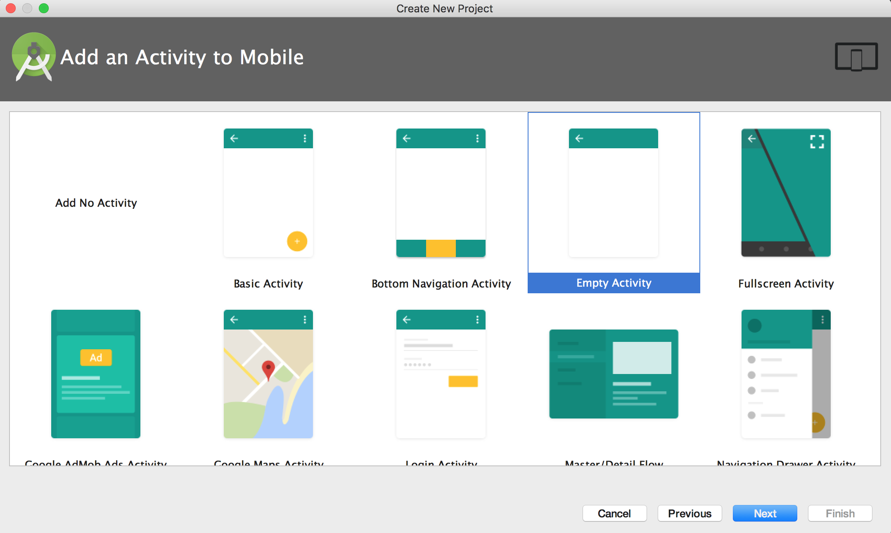

# Project Guide
## About Me Page

Use your knowledge of mobile user interfaces to build a single-screen app

Your app will be a mini-trading card about you

Your app should AT LEAST include:

<ul>  
  <li>Your name</li>
  <li>An image of or representing you</li>
  <li>The grade you're in</li>
  <li>The grade you're in</li>
  <li>Your favorite app and/or an app idea you have</li>
  <li>A very short bio that says why you were interested in the club, what you hope to learn, and what you want to do with what you learn in this club in the future</li>
</ul>

You will edit this [About Me XML](about-me.xml) starter code to complete this exercise

## Getting Started 

#### Open Android Studio & click "Start a new Android Studio project"

#### Give your app a name

#### Choose "API 15..." as the Minimum SDK

#### Choose the Empty Activity template

#### Click "Finish"

#### Replace all of the code in "activity_main.xml" with the "about-me.xml" starter code

 

Starter Code:

[About Me XML](about-me.xml) 

## Adding images

#### Download an image and rename it to something simple

#### Copy the image (Command + C)

#### Choose the "drawable" folder in Android Studio and paste the image (Command + V)

#### Press "Ok"

#### In the "android:src" attribute, add the image with "@drawable/your-image-name"

